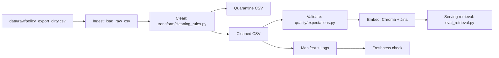

# Kiến trúc pipeline - Lab Day 10

**Nhóm:** Vin_Lab10  
**Cập nhật:** 2026-04-15

---

## 1. Sơ đồ luồng

- Điểm đo volume/lineage: `raw_records`, `cleaned_records`, `quarantine_records`, `run_id` trong `artifacts/logs/`.
- Điểm đo quality: `expectation[...]` pass/fail và `metric_impact[...]` theo từng rule.
- Điểm đo freshness: `freshness_check=PASS/WARN/FAIL` từ manifest.

---

## 2. Ranh giới trách nhiệm

| Thành phần | Input | Output | Owner nhóm |
|---|---|---|---|
| Ingest | `data/raw/*.csv` | `rows` | Ingestion Owner |
| Transform | raw rows | `cleaned_*.csv`, `quarantine_*.csv` | Cleaning/Quality Owner |
| Quality | cleaned rows | expectation results + halt/warn | Cleaning/Quality Owner |
| Embed | cleaned CSV | Chroma collection `day10_kb` | Embed Owner |
| Monitor | manifest JSON | freshness status + runbook action | Monitoring/Docs Owner |

---

## 3. Idempotency và rerun

- Upsert theo `chunk_id`: rerun không nhân bản vector cũ.
- Snapshot publish boundary: xoá id không còn trong cleaned (`embed_prune_removed`) trước khi upsert.
- Evidence: `run_sprint3.log` có `embed_prune_removed=1`, `embed_upsert count=6`.

---

## 4. Liên hệ Day 09

- Collection `day10_kb` là lớp dữ liệu đã clean/validate để truy xuất ổn định cho luồng RAG/agent Day 09.
- Khi pipeline cập nhật policy mới, retrieval của agent sẽ phản ánh phiên bản đã publish trong run mới nhất.

---

## 5. Rủi ro đã biết

- Freshness đang `FAIL` do dữ liệu mẫu có `exported_at=2026-04-10T08:00:00` (cũ hơn SLA 24h).
- Nếu Jina API/network gián đoạn, bước embed/query có thể lỗi; cần retry/backoff hoặc chế độ degrade theo runbook.
